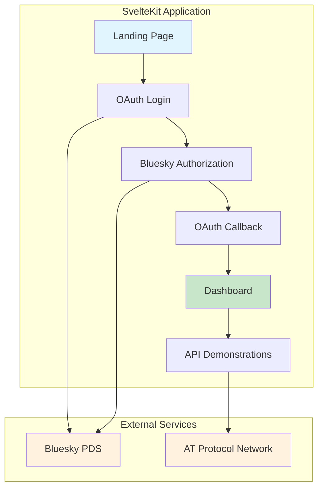
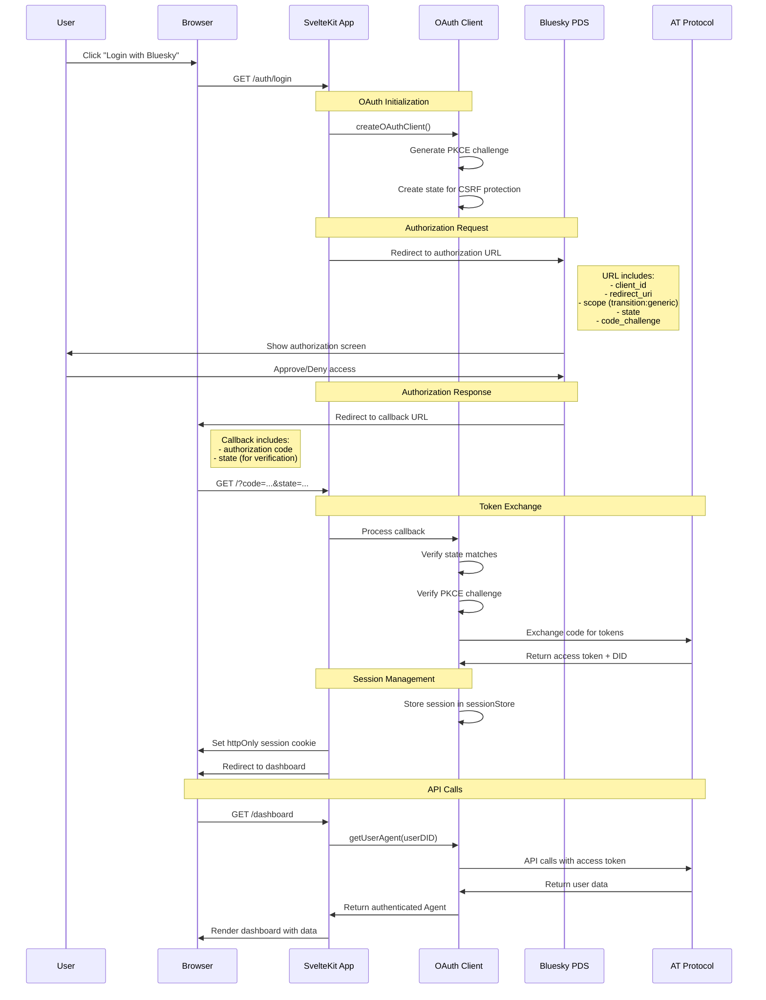
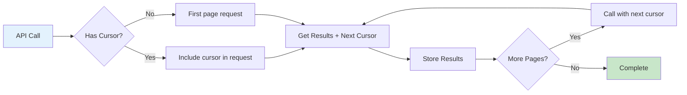
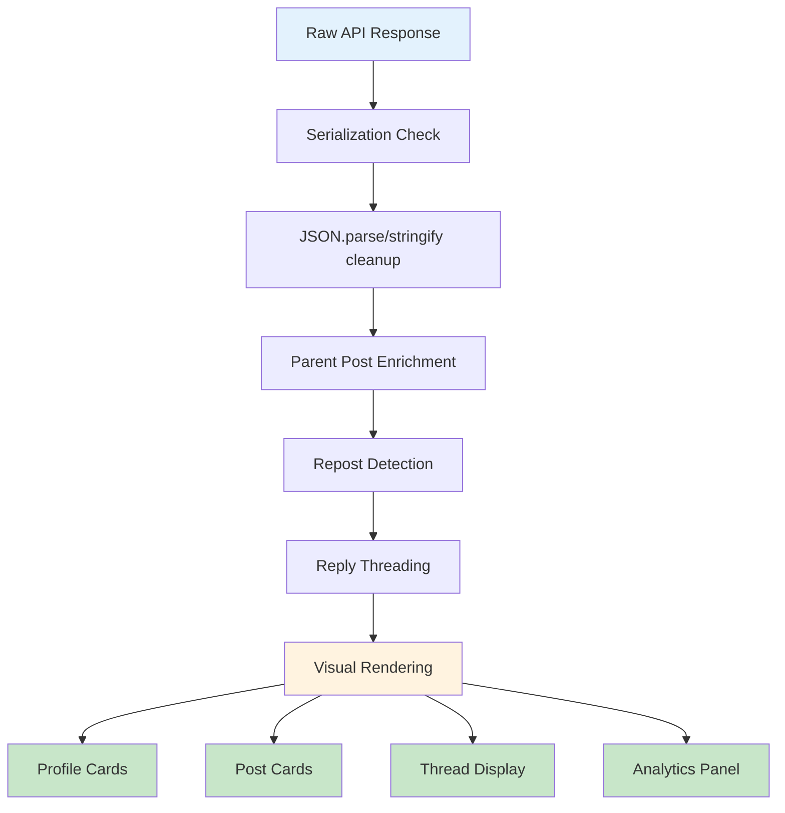

# SvelteKit Bluesky OAuth Guide

A comprehensive educational example demonstrating **server-side OAuth authentication** with Bluesky using the AT Protocol and `@atproto/oauth-client-node`.

## 🎯 What This Demonstrates

This application shows how to build a **complete OAuth-based Bluesky client** that:
- Implements proper server-side OAuth flow with PKCE
- Uses the `transition:generic` scope for full API access
- Demonstrates all major Bluesky APIs with visual UI
- Handles pagination, threading, and real-time data
- Provides educational context for each API response

## 🏗️ Architecture Overview



## 🔐 OAuth Flow Deep Dive

### User Authentication Journey

When a user clicks "Connect with Bluesky" on the login page, here's exactly what happens:

1. **OAuth Client Creation**: Server creates an OAuth client with proper configuration and generates a secure authorization URL with PKCE parameters
2. **Bluesky Authorization**: User is redirected to Bluesky to authorize this application and sign in with their credentials  
3. **Authorization Code Return**: Bluesky redirects back to our callback with an authorization code
4. **Token Exchange**: Server securely exchanges the authorization code for access and refresh tokens
5. **API Access**: User can now explore various AT Protocol API endpoints with their authenticated session

## 🔐 OAuth Flow Deep Dive

### The Complete Authentication Journey



### 🔑 Key OAuth Components

#### 1. **Localhost Development Exception**
```typescript
// Special client_id format for localhost development
const CLIENT_ID = `http://localhost?redirect_uri=${encodeURIComponent(REDIRECT_URI)}&scope=${encodeURIComponent(SCOPE)}`;
```

**Why this works:**
- Bluesky allows localhost clients to embed metadata in the client_id URL
- Avoids complex client registration for development
- Enables `transition:generic` scope without JWT signing

#### 2. **OAuth Client Configuration**
```typescript
const oauthClient = new NodeOAuthClient({
  clientMetadata: {
    client_id: CLIENT_ID,
    client_name: 'SvelteKit Bsky Guide', 
    redirect_uris: [REDIRECT_URI],
    scope: 'atproto transition:generic',
    application_type: 'native',
    token_endpoint_auth_method: 'none', // No JWT signing needed
    dpop_bound_access_tokens: true,
  },
  stateStore: { /* CSRF protection */ },
  sessionStore: { /* Token storage */ }
});
```

#### 3. **Session Flow**

```mermaid
flowchart LR
    A[User Login] --> B[Generate State]
    B --> C[Store State]
    C --> D[Redirect to Bluesky]
    D --> E[User Authorizes]
    E --> F[Callback with Code]
    F --> G[Verify State]
    G --> H[Exchange Code for Tokens]
    H --> I[Store Session]
    I --> J[Set Cookie]
    J --> K[Access Dashboard]
    
    style A fill:#e3f2fd
    style K fill:#c8e6c9
    style G fill:#fff3e0
    style I fill:#fff3e0
```


## 📁 File Structure & Responsibilities

```
src/
├── lib/
│   ├── server/bluesky/
│   │   ├── types.ts            # TypeScript type definitions
│   │   ├── oauth.ts            # OAuth service class
│   │   ├── api.ts              # API service class  
│   │   └── index.ts            # Main Bluesky service
│   └── components/
│       └── PostComponent.svelte # Reusable post rendering
├── routes/
│   ├── +page.server.ts          # OAuth callback handling
│   ├── +page.svelte            # Landing page with login
│   ├── auth/
│   │   ├── login/+server.ts    # Initiate OAuth flow
│   │   └── logout/+server.ts   # Clear sessions & cookies
│   ├── dashboard/
│   │   ├── +page.server.ts     # API calls & data fetching
│   │   └── +page.svelte        # Visual UI for all APIs
│   ├── debug/
│   │   └── +page.svelte        # JSON debugging interface
│   ├── client-metadata.json/   # OAuth client metadata endpoint
│   └── jwks.json/              # JWT keys endpoint (empty for 'none' auth)
```

### Key File Deep Dives

#### **`src/lib/server/bluesky/types.ts`** - Type Definitions
```typescript
// Comprehensive TypeScript types for all Bluesky API responses
export interface BlueskyProfile {
  did: DID;
  handle: string;
  displayName?: string;
  avatar?: string;
  description?: string;
  followersCount?: number;
  followsCount?: number;
  postsCount?: number;
}

export interface OAuthCallbackResult {
  success: boolean;
  userDid?: DID;
  profile?: BlueskyProfile;
  error?: string;
}
```

#### **`src/lib/server/bluesky/oauth.ts`** - OAuth Service Class
```typescript
export class BlueskyOAuthService {
  // Manages OAuth client lifecycle with correct snake_case properties
  private async getOAuthClient(): Promise<NodeOAuthClient>
  
  // Initiates OAuth login flow with custom domain handle support
  async initiateLogin(handle: string): Promise<string>
  
  // Handles OAuth callback and creates authenticated session
  async handleCallback(callbackUrl: string): Promise<OAuthCallbackResult>
  
  // Gets authenticated agent for API calls
  async getAuthenticatedAgent(userDid: DID): Promise<AuthenticatedAgent>
  
  // Validates existing sessions
  async hasValidSession(userDid: DID): Promise<boolean>
}
```

#### **`src/lib/server/bluesky/api.ts`** - API Service Class  
```typescript
export class BlueskyAPIService {
  // Executes different demo APIs with data enrichment
  async executeDemoAPI(
    userDid: DID,
    demoType: DemoType,
    actorIdentifier: string,
    limit: number
  ): Promise<DemoAPIResponse>
  
  // Individual API methods with response enrichment
  private async getProfile(agent: Agent, actor: string): Promise<ProfileResponse>
  private async getTimeline(agent: Agent, limit: number): Promise<TimelineResponse>
  private async getAuthorFeed(agent: Agent, actor: string, limit: number): Promise<AuthorFeedResponse>
  // ... other API methods
}
```

#### **`src/lib/server/bluesky/index.ts`** - Main Service Orchestrator
```typescript
export class BlueskyService {
  private oauthService: BlueskyOAuthService;
  private apiService: BlueskyAPIService;
  
  // Singleton pattern for consistent service usage
  async initiateOAuthLogin(handle: string): Promise<string>
  async handleOAuthCallback(callbackUrl: string, cookies: Cookies): Promise<OAuthCallbackResult>
  async executeDemoAPI(userDid: DID, demo: DemoType, actor: string, limit: number): Promise<DemoAPIResponse>
  async hasValidSession(userDid: DID): Promise<boolean>
}

// Factory function for consistent service access
export function getBlueskyService(): BlueskyService
```

#### **`src/routes/auth/login/+server.ts`** - OAuth Initiation
```typescript
export const GET: RequestHandler = async ({ url }) => {
  const handle = url.searchParams.get('handle') || '';
  
  // Use the refactored service architecture
  const bluesky = getBlueskyService();
  const authUrl = await bluesky.initiateOAuthLogin(handle);
  
  throw redirect(302, authUrl);
};
```

#### **`src/routes/+page.server.ts`** - OAuth Callback Handler
```typescript
export const load: PageServerLoad = async ({ url, cookies }) => {
  // Check if this is an OAuth callback
  const isRealOAuthCallback = url.searchParams.has('code') && url.searchParams.has('state');
  
  if (isRealOAuthCallback) {
    // Use the refactored service architecture
    const bluesky = getBlueskyService();
    const result = await bluesky.handleOAuthCallback(url.toString(), cookies);
    
    if (result.success && result.userDid) {
      return {
        isOAuthCallback: true,
        success: true,
        userDid: result.userDid,
        redirectTo: '/dashboard'
      };
    } else {
      throw redirect(302, '/?error=oauth_failed');
    }
  }
  
  return {
    isOAuthCallback: false,
    hasError: url.searchParams.get('error') === 'oauth_failed'
  };
};
```

## 🌐 API Integration Patterns

### Authentication-Required Endpoints

All Bluesky API calls now use the unified service architecture:

```typescript
// Unified API execution through service layer
const bluesky = getBlueskyService();
const response = await bluesky.executeDemoAPI(sessionId, 'profile', sessionId, 10);

if (response.success) {
  const profileData = response.data;
} else {
  const errorMessage = response.error?.message;
}
```

### Service Architecture Benefits

The refactored architecture provides:

1. **Type Safety**: Comprehensive TypeScript types for all responses
2. **Error Handling**: Consistent error handling across all APIs  
3. **Data Enrichment**: Automatic enhancement of API responses
4. **Session Management**: Unified session validation and cleanup
5. **Testing**: Easily mockable service classes for unit tests

### Pagination Handling



**Example: Getting All Followers**
```typescript
let allFollowers = [];
let cursor = undefined;

do {
  const response = await agent.getFollowers({
    actor: userDid,
    limit: 100,
    cursor
  });
  
  allFollowers.push(...response.data.followers);
  cursor = response.data.cursor;
} while (cursor);
```

### Error Handling Strategy

```typescript
try {
  const apiData = await agent.getTimeline({ limit: 10 });
} catch (error) {
  if (error.message.includes('scope')) {
    // Scope-related error - show educational message
    apiData = {
      error: true,
      message: error.message,
      requiredScope: "rpc:app.bsky.feed.getTimeline",
      explanation: "This API requires additional OAuth scopes."
    };
  } else {
    throw error; // Re-throw unexpected errors
  }
}
```

## 🎨 UI Components & Data Flow

### Reusable PostComponent Architecture

The application now features a unified `PostComponent.svelte` that handles all post rendering:

```typescript
// PostComponent.svelte props
export let post: any;                    // Post data object
export let showCopyButton = true;       // Show JSON copy button
export let copyButtonId = 'copy-btn';   // Unique button ID
export let showRepostIndicator = true;  // Show repost indicators
```

**Key Features:**
- **HLS.js Video Support**: Plays .m3u8 video streams properly
- **Copy JSON Functionality**: Hover-to-reveal copy buttons on all posts
- **Quote Post Rendering**: Handles nested quote posts with media
- **Repost Detection**: Visual indicators for reposts vs original posts
- **Engagement Stats**: Consistent display of likes, reposts, replies

**Usage Examples:**
```svelte
<!-- Dashboard timeline posts -->
<PostComponent 
  post={item} 
  copyButtonId="timeline-{index}"
  showRepostIndicator={true} 
/>

<!-- Debug page testing -->
<PostComponent 
  post={parsedPost} 
  showCopyButton={false}
  copyButtonId="debug-post-copy"
/>
```

### Debug Interface

New `/debug` page for JSON testing:
- Paste any post JSON to test UI rendering
- Validate JSON structure and troubleshoot display issues
- Test video playback and quote post rendering
- Copy button integration for easy data transfer

### Feed Visualization Pipeline



### Reply Chain Visualization

The app displays threaded conversations with visual hierarchy:

```
┌─ [Parent Post - gray border, smaller]
│   @originaluser: "Original post content..."
│
└─ [Current Post - indented, normal size]
    ↵ Replying
    @currentuser: "Reply content..."
```

Implementation:
```typescript
// Server-side: Fetch parent posts for replies
if (item.post.record?.reply?.parent?.uri) {
  const parentThread = await agent.getPostThread({
    uri: item.post.record.reply.parent.uri,
    depth: 0
  });
  item.parentPost = parentThread.data.thread.post;
}
```

### Repost Detection

Visual indicators show when content is reposted:

```typescript
{#if item.reason?.$type === 'app.bsky.feed.defs#reasonRepost'}
  <div class="repost-indicator">
    🔄 You reposted • {new Date(item.reason.indexedAt).toLocaleDateString()}
  </div>
{/if}
```

## 🔧 Environment Setup

### Required Environment Variables
```bash
# .env.local
PUBLIC_URL=http://127.0.0.1:5174
CLIENT_ID=http://localhost?redirect_uri=http%3A%2F%2F127.0.0.1%3A5174%2F&scope=atproto%20transition%3Ageneric

# Optional: For production deployment
# CLIENT_ID=https://yourapp.com/client-metadata.json
```

### Development vs Production

**Development (Localhost Exception):**
```typescript
const CLIENT_ID = `http://localhost?redirect_uri=${REDIRECT_URI}&scope=${SCOPE}`;
// ✅ No client registration needed
// ✅ Works with transition:generic scope
// ✅ No JWT key generation required
```

**Production (Full Client Registration):**
```typescript
const CLIENT_ID = 'https://yourapp.com/client-metadata.json';
// ❗ Requires proper client registration
// ❗ May need private_key_jwt authentication
// ❗ Requires proper OAuth provider configuration
```

## 🚀 Running the Application

```bash
# Install dependencies
npm install

# Start development server
npm run dev

# Build for production
npm run build
```

### OAuth Flow Testing

1. **Visit** `http://localhost:5173`
2. **Click** "Login with Bluesky"
3. **Enter** your Bluesky handle (e.g., `yourname.bsky.social`)
4. **Authorize** the application on Bluesky
5. **Explore** the API demonstrations on the dashboard

## 📊 Educational Features

### API Explanations
Each API includes contextual information:
- **Purpose**: What the API does
- **Scope Requirements**: Why certain APIs need specific permissions
- **Pagination**: How to handle large datasets
- **Data Structure**: Understanding the response format

### Visual Analytics
- **Post Type Breakdown**: Original posts vs reposts vs replies
- **Pagination Analysis**: API limits vs actual totals
- **Thread Structure**: Visual conversation mapping
- **Engagement Metrics**: Likes, reposts, replies with context

### Raw Data Access
Collapsible JSON viewers show the actual API responses for developers who want to understand the data structures.

## 🔍 Troubleshooting

### Common Issues

**❌ "Invalid client_id" Error**
```bash
# Check your PUBLIC_URL matches your development server
PUBLIC_URL=http://127.0.0.1:5174  # ✅ Correct
PUBLIC_URL=http://localhost:5173  # ❌ Port mismatch
```

**❌ "Scope not declared" Error**
```typescript
// Ensure transition:generic is in your client_id
const CLIENT_ID = `http://localhost?redirect_uri=${REDIRECT_URI}&scope=atproto%20transition%3Ageneric`;
```

**❌ Session Not Found**
```typescript
// Check cookie configuration
cookies.set('bsky_session', session.sub, {
  httpOnly: true,    // ✅ Security
  secure: false,     // ✅ OK for localhost
  sameSite: 'lax',   // ✅ CSRF protection
  path: '/'          // ✅ Site-wide access
});
```

### Debug Logging

Enable detailed OAuth logging:
```typescript
console.log('OAuth client created:', {
  clientId: CLIENT_ID,
  redirectUri: REDIRECT_URI,
  scope: SCOPE
});
```

## 🎓 Learning Outcomes

After exploring this application, developers will understand:

1. **OAuth 2.0 + PKCE Implementation** - Complete authorization code flow with security
2. **AT Protocol Integration** - How to interact with decentralized social networks
3. **Session Management** - Server-side token storage and cookie handling
4. **API Pagination** - Handling large datasets across multiple requests
5. **Social Media Data Structures** - Posts, threads, reposts, and user relationships
6. **SvelteKit Patterns** - Server-side rendering with authenticated API calls
7. **Error Handling** - Graceful degradation and educational error messages

## 🛠️ Production Considerations

### Security Checklist
- [ ] Use HTTPS in production
- [ ] Implement proper client registration
- [ ] Use persistent session storage (Redis/Database)
- [ ] Add rate limiting
- [ ] Implement proper error logging
- [ ] Use environment-specific configurations
- [ ] Add CSRF protection beyond OAuth state

### Scalability Notes
- [ ] Replace in-memory stores with persistent storage
- [ ] Implement session cleanup/expiration
- [ ] Add caching for frequently accessed data
- [ ] Consider implementing refresh token rotation
- [ ] Add monitoring and analytics

## 🔧 Technical Implementation Summary

### OAuth Configuration & Security Features

**OAuth Flow**: Authorization Code with PKCE (Proof Key for Code Exchange)  
**Authentication Method**: Private Key JWT (private_key_jwt)  
**Token Storage**: Server-side sessions with automatic refresh handling  
**Security Features**: DPoP (Demonstrating Proof of Possession), HTTPOnly cookies, CSRF protection via state parameter  
**Libraries Used**: @atproto/oauth-client-node, @atproto/api  
**Client Type**: Backend service (not native app or SPA)

### OAuth Requirements Compliance

✅ **Client Metadata**: Hosted at `/client-metadata.json` endpoint  
✅ **JWKS Endpoint**: Available at `/jwks.json` for JWT verification  
✅ **PKCE Support**: Proof Key for Code Exchange implemented  
✅ **DPoP Enabled**: Demonstrating Proof of Possession for enhanced security  
✅ **Token Refresh**: Automatic refresh token handling  
✅ **Session Management**: Secure server-side session storage and management

### Authentication Flow Endpoints

- `GET /auth/login` - Initiates OAuth flow with optional handle pre-fill
- `GET /auth/callback` - Handles OAuth callback and token exchange
- `GET /client-metadata.json` - OAuth client metadata
- `GET /jwks.json` - JSON Web Key Set for verification

This implementation follows OAuth 2.1 best practices and AT Protocol specifications for maximum security and compliance.

---

**Built with** ❤️ **using SvelteKit, AT Protocol, and educational intent.**

This application serves as both a functional Bluesky client and a comprehensive learning resource for OAuth implementation in modern web applications.