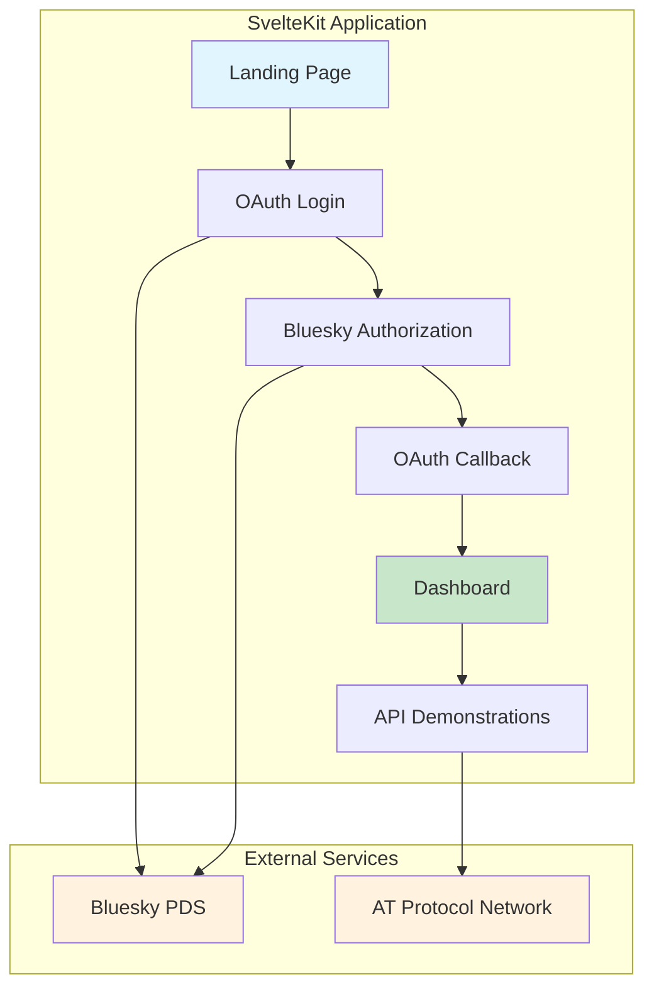
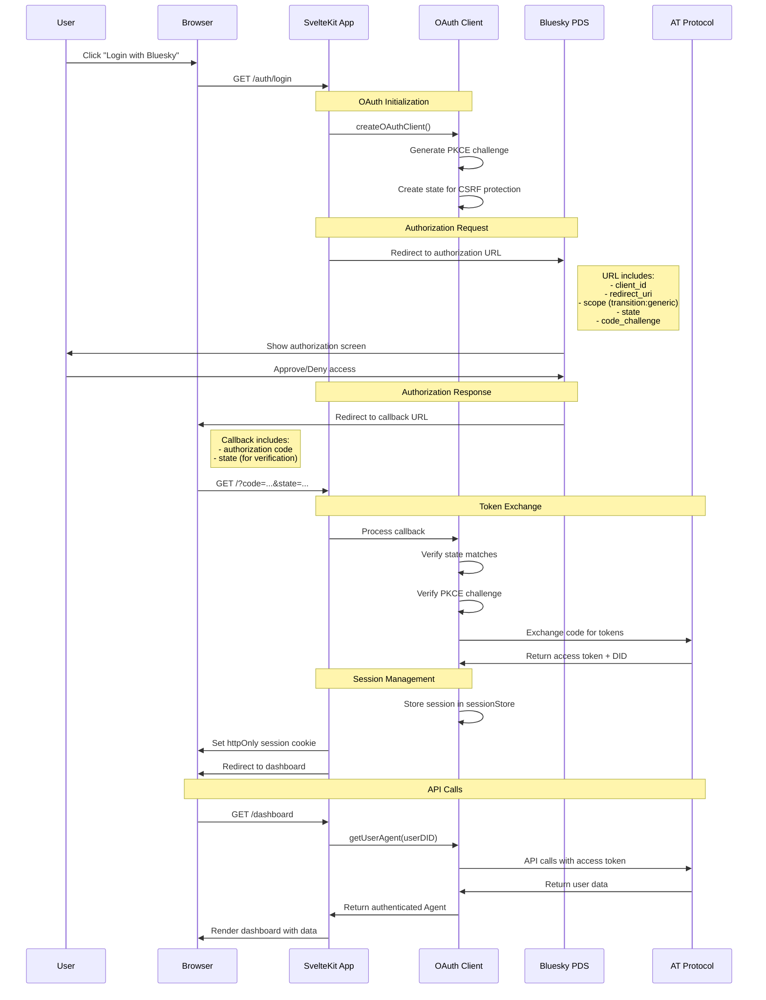
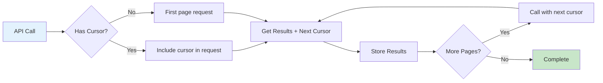
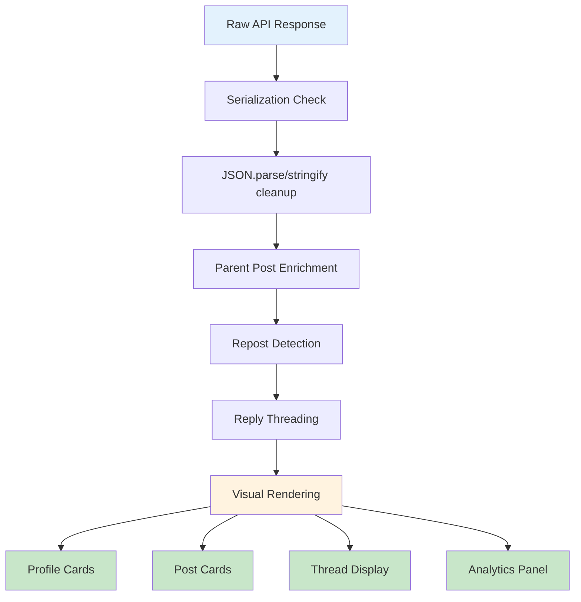

# SvelteKit Bluesky OAuth Guide

A comprehensive educational example demonstrating **server-side OAuth authentication** with Bluesky using the AT Protocol and `@atproto/oauth-client-node`.

## 🎯 What This Demonstrates

This application shows how to build a **complete OAuth-based Bluesky client** that:
- Implements proper server-side OAuth flow with PKCE
- Uses the `transition:generic` scope for full API access
- Demonstrates all major Bluesky APIs with visual UI
- Handles pagination, threading, and real-time data
- Provides educational context for each API response

## 🏗️ Architecture Overview



## 🔐 OAuth Flow Deep Dive

### The Complete Authentication Journey



### 🔑 Key OAuth Components

#### 1. **Localhost Development Exception**
```typescript
// Special client_id format for localhost development
const CLIENT_ID = `http://localhost?redirect_uri=${encodeURIComponent(REDIRECT_URI)}&scope=${encodeURIComponent(SCOPE)}`;
```

**Why this works:**
- Bluesky allows localhost clients to embed metadata in the client_id URL
- Avoids complex client registration for development
- Enables `transition:generic` scope without JWT signing

#### 2. **OAuth Client Configuration**
```typescript
const oauthClient = new NodeOAuthClient({
  clientMetadata: {
    client_id: CLIENT_ID,
    client_name: 'SvelteKit Bsky Guide', 
    redirect_uris: [REDIRECT_URI],
    scope: 'atproto transition:generic',
    application_type: 'native',
    token_endpoint_auth_method: 'none', // No JWT signing needed
    dpop_bound_access_tokens: true,
  },
  stateStore: { /* CSRF protection */ },
  sessionStore: { /* Token storage */ }
});
```

#### 3. **Session Flow**

```mermaid
flowchart LR
    A[User Login] --> B[Generate State]
    B --> C[Store State]
    C --> D[Redirect to Bluesky]
    D --> E[User Authorizes]
    E --> F[Callback with Code]
    F --> G[Verify State]
    G --> H[Exchange Code for Tokens]
    H --> I[Store Session]
    I --> J[Set Cookie]
    J --> K[Access Dashboard]
    
    style A fill:#e3f2fd
    style K fill:#c8e6c9
    style G fill:#fff3e0
    style I fill:#fff3e0
```


## 📁 File Structure & Responsibilities

```
src/
├── lib/server/
│   └── oauth.ts                 # OAuth client & session management
├── routes/
│   ├── +page.server.ts          # OAuth callback handling
│   ├── +page.svelte            # Landing page with login
│   ├── auth/
│   │   ├── login/+server.ts    # Initiate OAuth flow
│   │   └── logout/+server.ts   # Clear sessions & cookies
│   ├── dashboard/
│   │   ├── +page.server.ts     # API calls & data fetching
│   │   └── +page.svelte        # Visual UI for all APIs
│   ├── client-metadata.json/   # OAuth client metadata endpoint
│   └── jwks.json/              # JWT keys endpoint (empty for 'none' auth)
```

### Key File Deep Dives

#### **`src/lib/server/oauth.ts`** - The OAuth Engine
```typescript
export const createOAuthClient = async () => {
  // Creates singleton OAuth client with localhost config
  // Manages state store (CSRF protection)
  // Manages session store (token persistence)
}

export const getUserAgent = async (userDid: string) => {
  // Retrieves stored session for user
  // Returns authenticated AT Protocol Agent
  // Throws error if session invalid/expired
}
```

#### **`src/routes/auth/login/+server.ts`** - OAuth Initiation
```typescript
export const GET: RequestHandler = async ({ url }) => {
  const client = await createOAuthClient();
  const handle = url.searchParams.get('handle') || '';
  
  // Generate authorization URL with PKCE
  const authUrl = await client.authorize(handle, {
    state: crypto.randomUUID(),
    scope: 'atproto transition:generic',
    redirect_uri: REDIRECT_URI
  });
  
  throw redirect(302, authUrl.toString());
};
```

#### **`src/routes/+page.server.ts`** - OAuth Callback Handler
```typescript
export const load: PageServerLoad = async ({ url, cookies }) => {
  const code = url.searchParams.get('code');
  const state = url.searchParams.get('state');
  
  if (code && state) {
    // Process OAuth callback
    const client = await createOAuthClient();
    const { session } = await client.callback(new URL(url.toString()));
    
    // Store session & set cookie
    cookies.set('bsky_session', session.sub, {
      httpOnly: true,
      secure: true,
      sameSite: 'lax',
      maxAge: 60 * 60 * 24 * 7 // 1 week
    });
    
    return { isOAuthCallback: true, success: true };
  }
};
```

## 🌐 API Integration Patterns

### Authentication-Required Endpoints

All Bluesky API calls use the same pattern:

```typescript
const agent = await getUserAgent(sessionId);
const response = await agent.getProfile({ actor: sessionId });
```

### Pagination Handling



**Example: Getting All Followers**
```typescript
let allFollowers = [];
let cursor = undefined;

do {
  const response = await agent.getFollowers({
    actor: userDid,
    limit: 100,
    cursor
  });
  
  allFollowers.push(...response.data.followers);
  cursor = response.data.cursor;
} while (cursor);
```

### Error Handling Strategy

```typescript
try {
  const apiData = await agent.getTimeline({ limit: 10 });
} catch (error) {
  if (error.message.includes('scope')) {
    // Scope-related error - show educational message
    apiData = {
      error: true,
      message: error.message,
      requiredScope: "rpc:app.bsky.feed.getTimeline",
      explanation: "This API requires additional OAuth scopes."
    };
  } else {
    throw error; // Re-throw unexpected errors
  }
}
```

## 🎨 UI Components & Data Flow

### Feed Visualization Pipeline



### Reply Chain Visualization

The app displays threaded conversations with visual hierarchy:

```
┌─ [Parent Post - gray border, smaller]
│   @originaluser: "Original post content..."
│
└─ [Current Post - indented, normal size]
    ↵ Replying
    @currentuser: "Reply content..."
```

Implementation:
```typescript
// Server-side: Fetch parent posts for replies
if (item.post.record?.reply?.parent?.uri) {
  const parentThread = await agent.getPostThread({
    uri: item.post.record.reply.parent.uri,
    depth: 0
  });
  item.parentPost = parentThread.data.thread.post;
}
```

### Repost Detection

Visual indicators show when content is reposted:

```typescript
{#if item.reason?.$type === 'app.bsky.feed.defs#reasonRepost'}
  <div class="repost-indicator">
    🔄 You reposted • {new Date(item.reason.indexedAt).toLocaleDateString()}
  </div>
{/if}
```

## 🔧 Environment Setup

### Required Environment Variables
```bash
# .env.local
PUBLIC_URL=http://127.0.0.1:5174
CLIENT_ID=http://localhost?redirect_uri=http%3A%2F%2F127.0.0.1%3A5174%2F&scope=atproto%20transition%3Ageneric

# Optional: For production deployment
# CLIENT_ID=https://yourapp.com/client-metadata.json
```

### Development vs Production

**Development (Localhost Exception):**
```typescript
const CLIENT_ID = `http://localhost?redirect_uri=${REDIRECT_URI}&scope=${SCOPE}`;
// ✅ No client registration needed
// ✅ Works with transition:generic scope
// ✅ No JWT key generation required
```

**Production (Full Client Registration):**
```typescript
const CLIENT_ID = 'https://yourapp.com/client-metadata.json';
// ❗ Requires proper client registration
// ❗ May need private_key_jwt authentication
// ❗ Requires proper OAuth provider configuration
```

## 🚀 Running the Application

```bash
# Install dependencies
npm install

# Start development server
npm run dev

# Build for production
npm run build
```

### OAuth Flow Testing

1. **Visit** `http://localhost:5173`
2. **Click** "Login with Bluesky"
3. **Enter** your Bluesky handle (e.g., `yourname.bsky.social`)
4. **Authorize** the application on Bluesky
5. **Explore** the API demonstrations on the dashboard

## 📊 Educational Features

### API Explanations
Each API includes contextual information:
- **Purpose**: What the API does
- **Scope Requirements**: Why certain APIs need specific permissions
- **Pagination**: How to handle large datasets
- **Data Structure**: Understanding the response format

### Visual Analytics
- **Post Type Breakdown**: Original posts vs reposts vs replies
- **Pagination Analysis**: API limits vs actual totals
- **Thread Structure**: Visual conversation mapping
- **Engagement Metrics**: Likes, reposts, replies with context

### Raw Data Access
Collapsible JSON viewers show the actual API responses for developers who want to understand the data structures.

## 🔍 Troubleshooting

### Common Issues

**❌ "Invalid client_id" Error**
```bash
# Check your PUBLIC_URL matches your development server
PUBLIC_URL=http://127.0.0.1:5174  # ✅ Correct
PUBLIC_URL=http://localhost:5173  # ❌ Port mismatch
```

**❌ "Scope not declared" Error**
```typescript
// Ensure transition:generic is in your client_id
const CLIENT_ID = `http://localhost?redirect_uri=${REDIRECT_URI}&scope=atproto%20transition%3Ageneric`;
```

**❌ Session Not Found**
```typescript
// Check cookie configuration
cookies.set('bsky_session', session.sub, {
  httpOnly: true,    // ✅ Security
  secure: false,     // ✅ OK for localhost
  sameSite: 'lax',   // ✅ CSRF protection
  path: '/'          // ✅ Site-wide access
});
```

### Debug Logging

Enable detailed OAuth logging:
```typescript
console.log('OAuth client created:', {
  clientId: CLIENT_ID,
  redirectUri: REDIRECT_URI,
  scope: SCOPE
});
```

## 🎓 Learning Outcomes

After exploring this application, developers will understand:

1. **OAuth 2.0 + PKCE Implementation** - Complete authorization code flow with security
2. **AT Protocol Integration** - How to interact with decentralized social networks
3. **Session Management** - Server-side token storage and cookie handling
4. **API Pagination** - Handling large datasets across multiple requests
5. **Social Media Data Structures** - Posts, threads, reposts, and user relationships
6. **SvelteKit Patterns** - Server-side rendering with authenticated API calls
7. **Error Handling** - Graceful degradation and educational error messages

## 🛠️ Production Considerations

### Security Checklist
- [ ] Use HTTPS in production
- [ ] Implement proper client registration
- [ ] Use persistent session storage (Redis/Database)
- [ ] Add rate limiting
- [ ] Implement proper error logging
- [ ] Use environment-specific configurations
- [ ] Add CSRF protection beyond OAuth state

### Scalability Notes
- [ ] Replace in-memory stores with persistent storage
- [ ] Implement session cleanup/expiration
- [ ] Add caching for frequently accessed data
- [ ] Consider implementing refresh token rotation
- [ ] Add monitoring and analytics

---

**Built with** ❤️ **using SvelteKit, AT Protocol, and educational intent.**

This application serves as both a functional Bluesky client and a comprehensive learning resource for OAuth implementation in modern web applications.