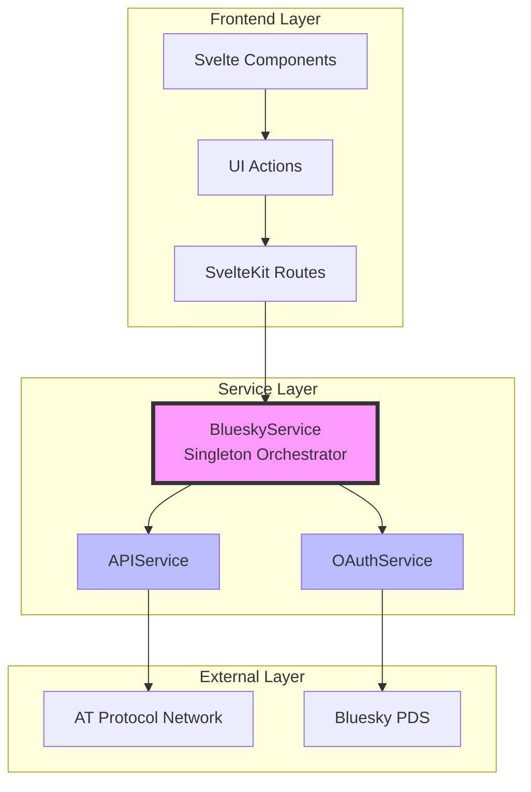
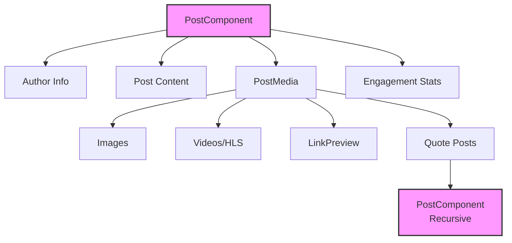
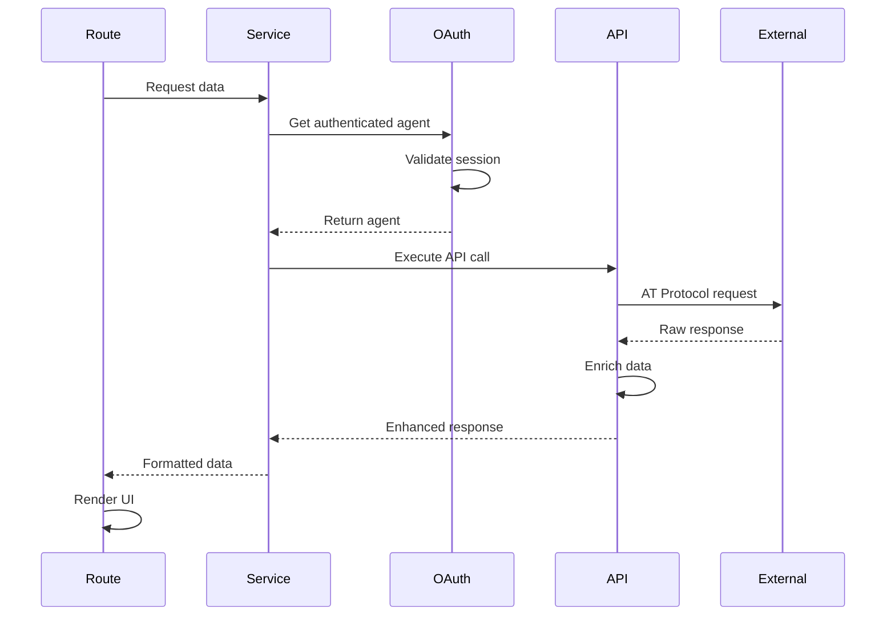

# Architecture Guide

This document details the service-oriented architecture, component structure, and data flow patterns used in the Bluesky Playground application.

## Service Architecture Overview



## File Structure

```
bluesky-playground/
├── src/
│   ├── lib/
│   │   ├── server/bluesky/       # Backend services
│   │   │   ├── index.ts          # Main service orchestrator
│   │   │   ├── oauth.ts          # OAuth handling service
│   │   │   ├── api.ts            # API interaction service
│   │   │   └── types.ts          # TypeScript definitions
│   │   └── components/           
│   │       ├── PostComponent.svelte     # Unified post renderer
│   │       ├── PostMedia.svelte         # Media handling
│   │       └── LinkPreview.svelte       # External link cards
│   └── routes/
│       ├── +layout.svelte        # App layout wrapper
│       ├── +page.svelte          # Login landing page
│       ├── +page.server.ts       # OAuth callback handler
│       ├── auth/
│       │   ├── login/+server.ts # OAuth initiation
│       │   └── logout/+server.ts # Session cleanup
│       ├── dashboard/
│       │   ├── +page.server.ts  # Protected data loading
│       │   └── +page.svelte     # Dashboard UI
│       └── debug/
│           └── +page.svelte      # JSON testing interface
```

## Core Services

### BlueskyService (Orchestrator)

The main service that coordinates all operations:

```typescript
export class BlueskyService {
  private oauthService: BlueskyOAuthService;
  private apiService: BlueskyAPIService;
  
  constructor() {
    this.oauthService = new BlueskyOAuthService();
    this.apiService = new BlueskyAPIService(this.oauthService);
  }
  
  // OAuth operations
  async initiateOAuthLogin(handle: string): Promise<string>
  async handleOAuthCallback(url: string, cookies: Cookies): Promise<OAuthCallbackResult>
  
  // API operations  
  async executeDemoAPI(userDid: DID, demo: DemoType, actor: string, limit: number): Promise<DemoAPIResponse>
  
  // Session management
  async hasValidSession(userDid: DID): Promise<boolean>
  async clearSession(userDid: DID, cookies: Cookies): Promise<void>
}
```

**Singleton Pattern:**
```typescript
let serviceInstance: BlueskyService | null = null;

export function getBlueskyService(): BlueskyService {
  if (!serviceInstance) {
    serviceInstance = new BlueskyService();
  }
  return serviceInstance;
}
```

### OAuthService

Manages authentication flow and sessions:

```typescript
export class BlueskyOAuthService {
  private sessionStore: MemorySessionStore;
  private stateStore: MemoryStateStore;
  
  // OAuth client configuration with snake_case properties
  private getOAuthClientConfig() {
    return {
      client_id: CLIENT_ID,
      client_name: 'Bluesky Playground',
      redirect_uris: [REDIRECT_URI],
      scope: 'atproto transition:generic',
      dpop_bound_access_tokens: true,
      token_endpoint_auth_method: 'none'
    };
  }
  
  // Core OAuth operations
  async initiateLogin(handle: string): Promise<string>
  async handleCallback(callbackUrl: string): Promise<OAuthCallbackResult>
  async getAuthenticatedAgent(userDid: DID): Promise<Agent>
  async hasValidSession(userDid: DID): Promise<boolean>
}
```

### APIService

Handles all Bluesky API interactions with data enrichment:

```typescript
export class BlueskyAPIService {
  constructor(private oauthService: BlueskyOAuthService) {}
  
  async executeDemoAPI(
    userDid: DID,
    demoType: DemoType,
    actorIdentifier: string,
    limit: number = 10
  ): Promise<DemoAPIResponse> {
    const agent = await this.oauthService.getAuthenticatedAgent(userDid);
    
    switch (demoType) {
      case 'profile':
        return this.getProfile(agent, actorIdentifier);
      case 'timeline':
        return this.getTimeline(agent, limit);
      case 'authorFeed':
        return this.getAuthorFeed(agent, actorIdentifier, limit);
      // ... other APIs
    }
  }
  
  // Data enrichment for replies
  private async enrichPostWithParent(agent: Agent, post: any): Promise<any> {
    if (post.record?.reply?.parent?.uri) {
      const parentThread = await agent.getPostThread({
        uri: post.record.reply.parent.uri,
        depth: 0
      });
      post.parentPost = parentThread.data.thread.post;
    }
    return post;
  }
}
```

## Component Architecture

### PostComponent

The unified post renderer handling all post types:

```svelte
<script lang="ts">
  export let post: any;
  export let showCopyButton = true;
  export let copyButtonId = 'copy-btn';
  export let showRepostIndicator = true;
</script>
```

**Features:**
- HLS.js video playback
- Quote post embedding
- Reply context display
- JSON copy functionality
- Engagement metrics

### Component Hierarchy



### Data Flow Patterns



## State Management

### Session State

Server-side session management with cookies:

```typescript
// Setting session
cookies.set('bsky_session', userDid, {
  httpOnly: true,
  secure: false, // true in production
  sameSite: 'lax',
  path: '/',
  maxAge: 60 * 60 * 24 // 24 hours
});

// Reading session
const sessionId = cookies.get('bsky_session');

// Validating session
const isValid = await bluesky.hasValidSession(sessionId);
```

### Component State

Local state management in Svelte components:

```svelte
<script lang="ts">
  // Reactive state
  let loading = false;
  let error: string | null = null;
  let data: any = null;
  
  // Reactive statements
  $: hasData = data !== null;
  $: errorMessage = error || 'An error occurred';
</script>
```

## Data Enrichment Patterns

### Reply Context Enhancement

```typescript
// Fetch and attach parent post for replies
if (post.record?.reply?.parent?.uri) {
  const parentThread = await agent.getPostThread({
    uri: post.record.reply.parent.uri,
    depth: 0
  });
  post.parentPost = parentThread.data.thread.post;
}
```

### Timeline Processing

```typescript
// Process timeline posts
const enrichedPosts = await Promise.all(
  timeline.feed.map(async (item) => {
    // Detect reposts
    if (item.reason?.$type === 'app.bsky.feed.defs#reasonRepost') {
      item.isRepost = true;
    }
    
    // Add parent for replies
    if (item.post.record?.reply) {
      await this.enrichPostWithParent(agent, item.post);
    }
    
    return item;
  })
);
```

## Error Handling Strategy

### Service Layer

```typescript
try {
  const result = await operation();
  return { success: true, data: result };
} catch (error) {
  console.error('Service error:', error);
  return { 
    success: false, 
    error: {
      message: error.message,
      code: error.code || 'UNKNOWN_ERROR'
    }
  };
}
```

### Route Layer

```typescript
const result = await bluesky.executeDemoAPI(...);

if (!result.success) {
  return {
    error: result.error?.message || 'Operation failed'
  };
}

return {
  data: result.data
};
```

### Component Layer

```svelte
{#if error}
  <div class="alert alert-error">
    <span>{error}</span>
  </div>
{:else if loading}
  <div class="loading loading-spinner" />
{:else if data}
  <!-- Render data -->
{/if}
```

## Performance Optimizations

### Singleton Services

Prevents multiple OAuth client instantiations:

```typescript
// Single instance across all requests
const bluesky = getBlueskyService();
```

### Lazy Loading

Components loaded on-demand:

```svelte
{#if showVideo}
  {#await import('./VideoPlayer.svelte') then { default: VideoPlayer }}
    <VideoPlayer {videoUrl} />
  {/await}
{/if}
```

### Data Caching

Session-based caching for expensive operations:

```typescript
class CachedAPIService {
  private cache = new Map<string, CacheEntry>();
  
  async getCached(key: string, fetcher: () => Promise<any>) {
    if (this.cache.has(key)) {
      const entry = this.cache.get(key);
      if (Date.now() - entry.timestamp < 5 * 60 * 1000) {
        return entry.data;
      }
    }
    
    const data = await fetcher();
    this.cache.set(key, { data, timestamp: Date.now() });
    return data;
  }
}
```

## Testing Considerations

### Service Mocking

```typescript
// Mock OAuth service for testing
class MockOAuthService extends BlueskyOAuthService {
  async getAuthenticatedAgent(userDid: DID) {
    return new MockAgent(testData);
  }
}
```

### Component Testing

```typescript
// Test PostComponent rendering
import { render } from '@testing-library/svelte';
import PostComponent from '$lib/components/PostComponent.svelte';

test('renders post content', () => {
  const { getByText } = render(PostComponent, {
    props: { post: mockPost }
  });
  
  expect(getByText(mockPost.record.text)).toBeTruthy();
});
```

## Security Patterns

### Input Validation

```typescript
// Validate handle format
if (!handle.match(/^([a-z0-9-]+\.)+[a-z]+$/)) {
  throw new Error('Invalid handle format');
}
```

### XSS Prevention

```svelte
<!-- Safe HTML rendering -->
{@html sanitizeHtml(content)}

<!-- Text content (auto-escaped) -->
{post.record.text}
```

### CSRF Protection

- OAuth state parameter validation
- SameSite cookie configuration
- Origin header verification

## Deployment Architecture

### Development

```
Developer Machine
├── SvelteKit Dev Server (5174)
├── In-memory Session Store
└── Direct AT Protocol Access
```

### Production

```
Production Server
├── Node.js Application
├── Redis Session Store
├── Reverse Proxy (nginx)
├── SSL Termination
└── AT Protocol via HTTPS
```