# Understanding OAuth 2.0 and AT Protocol: A Developer's Guide

*How AT Protocol builds on OAuth 2.0 to create secure, decentralized authentication*

## The Problem OAuth Solves

Imagine you want to use a photo printing service to print your Google Photos. The old way would be:

1. Give the printing service your Google username and password
2. They log into your Google account as you
3. Download your photos and print them

This is **terrible** for security:
- The printing service now has your Google password
- They can access your email, docs, everything
- If they get hacked, your entire Google account is compromised
- You can't revoke access without changing your password

OAuth solves this with **delegated authorization** - giving limited access without sharing credentials.

## OAuth 2.0: The Hotel Key Card Model

Think of OAuth like a hotel key card system:

```mermaid
graph TB
    A[👤 You<br/>Hotel Guest] --> B[🏨 Hotel Front Desk<br/>Authorization Server]
    A --> C[🧹 Housekeeping Service<br/>Third-party App]
    B --> D[🎫 Temporary Key Card<br/>Access Token]
    D --> E[🚪 Your Hotel Room<br/>Your Data]
    C --> D
    D --> C
    
    style A fill:#e1f5fe
    style B fill:#f3e5f5
    style C fill:#fff3e0
    style D fill:#e8f5e8
    style E fill:#fce4ec
```



**The key card (access token):**
- ✅ Only works for your specific room (limited scope)
- ⏰ Only works during housekeeping hours (expires)
- 🚫 Can be deactivated instantly (revoked)
- 🔒 Doesn't give access to the safe or other rooms

## The OAuth Dance: Step by Step

### Cast of Characters

```mermaid
graph LR
    A[👤 Resource Owner<br/>You] 
    B[📱 Client<br/>Photo Printer App]
    C[🔐 Authorization Server<br/>Google OAuth]
    D[📊 Resource Server<br/>Google Photos API]
    
    style A fill:#e3f2fd
    style B fill:#fff3e0
    style C fill:#f3e5f5
    style D fill:#e8f5e8
```



- **Resource Owner**: You (the user with data to protect)
- **Client**: The app that wants access (photo printer)
- **Authorization Server**: Issues tokens (Google OAuth)
- **Resource Server**: Holds your data (Google Photos API)

### The Complete OAuth Flow

```mermaid
sequenceDiagram
    participant U as 👤 User
    participant C as 📱 Client App
    participant A as 🔐 Auth Server
    participant R as 📊 Resource Server
    
    U->>C: 1. "I want to print photos"
    C->>U: 2. Redirect to authorization URL
    U->>A: 3. "PhotoApp wants access to photos"
    A->>U: 4. Show consent screen
    U->>A: 5. Click "Allow"
    A->>C: 6. Redirect with auth code
    C->>A: 7. Exchange code for tokens
    A->>C: 8. Return access + refresh tokens
    C->>R: 9. API call with access token
    R->>C: 10. Return user's photos
    C->>U: 11. "Here are your printed photos!"
```



#### 1. "I Need Access"
The photo printing app redirects you to Google:

```
https://accounts.google.com/oauth/authorize?
  client_id=photo-printer-app
  &redirect_uri=https://photoprinter.com/callback  
  &response_type=code
  &scope=photos.readonly
  &state=random-csrf-token
```

**Translation**: "Hi Google, I'm the photo printer app. I want read-only access to this user's photos. When you're done, send them back to my callback URL."

#### 2. "Do You Trust This App?"
You see Google's consent screen:

```
🔐 Google Account

PhotoPrinter wants to:
✓ View your Google Photos
✓ Download photos you select

This will allow PhotoPrinter to see photos in your account.

[Cancel] [Allow]
```

#### 3. "Here's a Temporary Voucher"
If you click "Allow", Google redirects you back:

```
https://photoprinter.com/callback?
  code=4/P7q7W91a-oMsCeLvIaQm6bTrgtp7
  &state=random-csrf-token
```

**Important**: This `code` is NOT the access token! It's a temporary voucher that expires in 10 minutes.

#### 4. "Exchange Voucher for Access Token"
PhotoPrinter's server exchanges the voucher:

```http
POST https://oauth2.googleapis.com/token
Content-Type: application/x-www-form-urlencoded

grant_type=authorization_code
&code=4/P7q7W91a-oMsCeLvIaQm6bTrgtp7
&client_id=photo-printer-app
&client_secret=super-secret-key
&redirect_uri=https://photoprinter.com/callback
```

Google responds:
```json
{
  "access_token": "ya29.a0AfH6SMC...",
  "refresh_token": "1//04-rNNjgkf...", 
  "expires_in": 3600,
  "token_type": "Bearer",
  "scope": "photos.readonly"
}
```

#### 5. "Use the Hotel Key Card"
Now PhotoPrinter can access your photos:

```http
GET https://photoslibrary.googleapis.com/v1/mediaItems
Authorization: Bearer ya29.a0AfH6SMC...
```

## Security Features Explained

### PKCE: Protecting Mobile Apps
**Problem**: Mobile apps can't securely store client secrets.

```mermaid
graph TB
    A[📱 Mobile App] --> B{Can store secrets?}
    B -->|❌ No| C[PKCE Flow]
    B -->|✅ Yes| D[Client Secret Flow]
    
    C --> E[Generate random verifier]
    E --> F[Hash verifier → challenge]
    F --> G[Send challenge in auth request]
    G --> H[Send verifier in token request]
    H --> I[✅ Server verifies: hash(verifier) = challenge]
    
    style A fill:#fff3e0
    style C fill:#e8f5e8
    style D fill:#ffebee
    style I fill:#e8f5e8
```

**Solution**: PKCE (Proof Key for Code Exchange) - the app creates its own temporary secret:

```javascript
// 1. Generate a random secret
const codeVerifier = 'dBjftJeZ4CVP-mB92K27uhbUJU1p1r_wW1gFWFOEjXk';

// 2. Hash it
const codeChallenge = sha256(codeVerifier);

// 3. Send the hash in the authorization request
const authUrl = 'https://accounts.google.com/oauth/authorize?' +
  'code_challenge=' + codeChallenge +
  '&code_challenge_method=S256';

// 4. Send the original secret when exchanging the code
const tokenRequest = {
  code: 'auth-code',
  code_verifier: codeVerifier  // Proves you made the original request
};
```

### State Parameter: CSRF Protection
The `state` parameter prevents Cross-Site Request Forgery:

```javascript
// 1. Generate random state
const state = crypto.randomUUID();
sessionStorage.setItem('oauth_state', state);

// 2. Include in authorization URL  
const authUrl = '...&state=' + state;

// 3. Verify on callback
const returnedState = urlParams.get('state');
if (returnedState !== sessionStorage.getItem('oauth_state')) {
  throw new Error('Potential CSRF attack!');
}
```

### Refresh Tokens: Long-Term Access
Access tokens expire quickly (typically 1 hour). Refresh tokens let you get new access tokens without user interaction:

```http
POST https://oauth2.googleapis.com/token
Content-Type: application/x-www-form-urlencoded

grant_type=refresh_token
&refresh_token=1//04-rNNjgkf...
&client_id=photo-printer-app
```

## What Makes AT Protocol Different

AT Protocol takes OAuth 2.0 and adds several innovations for decentralized social networking.

### 1. Distributed Identity Resolution

**Traditional OAuth**: You always go to the same authorization server (like accounts.google.com).

```mermaid
graph TB
    A[👤 All Users] --> B[🔐 Single OAuth Server<br/>accounts.google.com]
    B --> C[📊 Single Resource Server<br/>api.google.com]
    
    style A fill:#e3f2fd
    style B fill:#f3e5f5
    style C fill:#e8f5e8
```



**AT Protocol**: Users can be on different servers, but the system figures out where to send them.

```mermaid
graph TB
    A[👤 alice.bsky.social] --> D[🔍 Identity Resolution]
    B[👤 bob.example.com] --> D
    C[👤 carol.social] --> D
    
    D --> E[📋 alice → did:plc:abc123]
    D --> F[📋 bob → did:plc:def456] 
    D --> G[📋 carol → did:plc:ghi789]
    
    E --> H[🔐 bsky.social OAuth]
    F --> I[🔐 example.com OAuth]
    G --> J[🔐 carol.social OAuth]
    
    H --> K[📊 Alice's PDS]
    I --> L[📊 Bob's PDS]
    J --> M[📊 Carol's PDS]
    
    style D fill:#fff3e0
    style H fill:#f3e5f5
    style I fill:#f3e5f5
    style J fill:#f3e5f5
```



**The Resolution Process:**
```
Input: alice.bsky.social
↓
DNS Resolution: Find DID document  
↓
DID Resolution: did:plc:abc123 → Personal Data Server
↓
OAuth Discovery: Find authorization endpoints
↓
Result: OAuth with alice's specific server
```

This means `alice.bsky.social` and `bob.custom-domain.com` can both use your app, even though they're on completely different servers!

### 2. DPoP: Proof of Possession

**Traditional OAuth - Bearer Tokens:**
```mermaid
graph LR
    A[😈 Attacker intercepts token] --> B[🔓 "Bearer abc123"]
    B --> C[📊 API Server]
    C --> D[✅ Token valid → Access granted]
    
    style A fill:#ffebee
    style D fill:#ffebee
```

**AT Protocol - DPoP Tokens:**
```mermaid
graph LR
    A[😈 Attacker intercepts token] --> B[🔒 "DPoP abc123" + JWT proof]
    B --> C{Has private key?}
    C -->|❌ No| D[❌ Access denied]
    C -->|✅ Yes| E[✅ Access granted]
    
    style A fill:#ffebee
    style D fill:#e8f5e8
    style E fill:#fff3e0
```

Standard OAuth uses **Bearer tokens** - anyone with the token can use it:

```http
Authorization: Bearer ya29.a0AfH6SMC...
```

AT Protocol uses **DPoP (Demonstration of Proof of Possession)**:

```http
Authorization: DPoP ya29.a0AfH6SMC...
DPoP: eyJ0eXAiOiJkcG9wK2p3dCJ9.eyJqdGkiOiJlLWZha...
```

The `DPoP` header contains a JWT signed with your app's private key, proving you own the token. Even if someone steals your access token, they can't use it without your private key!

**DPoP JWT payload**:
```json
{
  "jti": "unique-request-id",
  "htm": "GET",
  "htu": "https://bsky.social/xrpc/app.bsky.feed.getTimeline", 
  "iat": 1640995200
}
```

### 3. Localhost Development Pattern

AT Protocol has a special pattern for local development that handles custom domains:

```javascript
// Instead of registering each localhost URL
const clientId = 'http://localhost?' + 
  'redirect_uri=' + encodeURIComponent('http://localhost:5174/callback') +
  '&scope=' + encodeURIComponent('atproto transition:generic');
```

This single client ID works for any localhost port and supports custom domain handles like `alice.example.com`.

### 4. Scope Simplification

Traditional OAuth has complex scopes:
```
scope=user:read user:write followers:read posts:write
```

AT Protocol uses broader scopes:
```
scope=atproto transition:generic
```

Granular permissions are handled at the API level, not the OAuth level.

## Real-World Example: Building a Bluesky Client

Here's how you'd implement AT Protocol OAuth in a SvelteKit app:

```mermaid
graph TB
    A[👤 User visits app] --> B[📱 SvelteKit App]
    B --> C{Authenticated?}
    C -->|❌ No| D[🔍 Handle Resolution]
    D --> E[🔐 AT Protocol OAuth]
    E --> F[✅ Store Session + DPoP Keys]
    F --> G[📊 API Calls with DPoP]
    C -->|✅ Yes| G
    G --> H[🎉 Show Timeline]
    
    style A fill:#e3f2fd
    style B fill:#fff3e0
    style E fill:#f3e5f5
    style G fill:#e8f5e8
    style H fill:#e8f5e8
```



### 1. Handle Identity Resolution
```typescript
// User enters: alice.bsky.social
// System resolves to DID and OAuth endpoints automatically
const authUrl = await client.authorize('alice.bsky.social');
```

### 2. OAuth Client Configuration  
```typescript
const oauthClient = new NodeOAuthClient({
  clientMetadata: {
    client_id: 'http://localhost?redirect_uri=...', // Special localhost pattern
    client_name: 'My Bluesky App',
    redirect_uris: ['http://localhost:5174/callback'],
    application_type: 'web',
    token_endpoint_auth_method: 'none', // No client secret needed
    dpop_bound_access_tokens: true,     // Enable DPoP
  }
});
```

### 3. Handle the Callback
```typescript
export const GET: RequestHandler = async ({ url, cookies }) => {
  const result = await oauthClient.callback(url.toString());
  
  if (result.session) {
    // Store session - includes DPoP key pairs
    cookies.set('session', result.session.did);
    redirect(302, '/dashboard');
  }
};
```

### 4. Make API Calls
```typescript
// The magic: OAuth client handles DPoP automatically
const agent = new Agent(session);
const timeline = await agent.getTimeline(); // DPoP proof generated automatically
```

## Why This Matters for Developers

### The Complexity Problem
Standard OAuth 2.0 + AT Protocol features create a lot of complexity:

```mermaid
graph TD
    A[😰 Developer Problem] --> B[🔍 Identity Resolution<br/>handles → DIDs → servers]
    A --> C[🔐 PKCE Implementation<br/>crypto + state management]
    A --> D[🛡️ CSRF Protection<br/>state parameter validation]
    A --> E[🔑 DPoP Proof Generation<br/>JWT for every request]
    A --> F[🔄 Token Refresh<br/>with DPoP key rotation]
    A --> G[💾 Session Persistence<br/>across stateless requests]
    
    B --> H[📚 200+ lines of setup code]
    C --> H
    D --> H
    E --> H
    F --> H
    G --> H
    
    style A fill:#ffebee
    style H fill:#ffebee
```



### The Solution: Abstraction
A well-designed AT Protocol OAuth library should hide this complexity:

```mermaid
graph LR
    A[😰 200+ lines of OAuth setup] --> B[📦 AT Protocol Library]
    B --> C[😊 3 lines of code]
    
    D[🔧 Complex Configuration] --> B
    E[🔐 Identity Resolution] --> B  
    F[🛡️ Security Implementation] --> B
    G[💾 Session Management] --> B
    
    style A fill:#ffebee
    style C fill:#e8f5e8
    style B fill:#fff3e0
```



```typescript
// Instead of 200+ lines of OAuth setup
const config = {
  clientId: generateComplexClientId(),
  pkceVerifier: generatePKCEVerifier(),
  stateStore: new Map(),
  // ... dozens more config options
};

// Just this:
const api = await locals.atproto.requireAuth();
const posts = await api.getTimeline();
```

## Conclusion

OAuth 2.0 solved the fundamental problem of secure, delegated access to user data. AT Protocol builds on this foundation to create something new: **decentralized OAuth** where users can be on any server but still securely authorize apps.

The key innovations are:

1. **Distributed Identity**: Users aren't tied to a single provider
2. **DPoP Security**: Tokens are cryptographically bound to your app  
3. **Developer Experience**: Complex flows hidden behind simple APIs

For developers building on AT Protocol, the goal should be to expose the power of decentralized social networking while hiding the OAuth complexity. When done right, adding AT Protocol OAuth to your app should be as simple as:

```bash
npm install @yourorg/atproto-oauth-sveltekit
```

```typescript
// .env
ATPROTO_PUBLIC_URL=http://localhost:5174
ATPROTO_CLIENT_NAME="My Cool App"

// src/hooks.server.ts  
export { handle } from '@yourorg/atproto-oauth-sveltekit';

// src/routes/dashboard/+page.server.ts
export const load = async ({ locals }) => {
  const api = await locals.atproto.requireAuth();
  return { timeline: await api.getTimeline() };
};
```

That's the power of good abstraction - making complex things simple without losing flexibility.

---

*Want to see this in action? Check out our [Bluesky Playground](https://github.com/danlourenco/bluesky-playground) - a complete AT Protocol OAuth implementation in SvelteKit.*