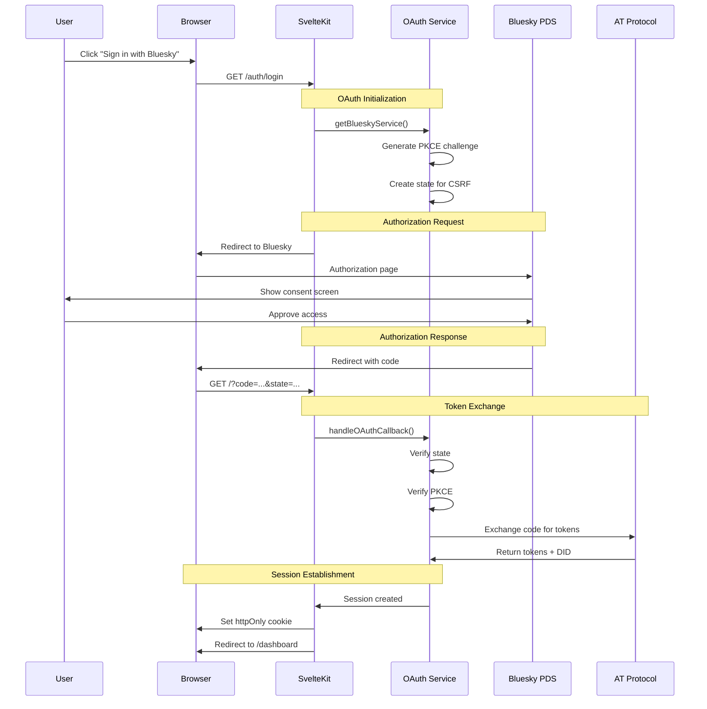
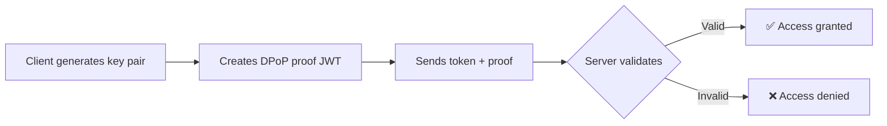

# OAuth Implementation Guide

This document provides a deep technical dive into the OAuth 2.0 + PKCE implementation for Bluesky/AT Protocol authentication.

## OAuth Flow Architecture

### Complete Authentication Journey



## Implementation Details

### Service Architecture

The OAuth implementation uses a service-oriented architecture with singleton pattern:

```typescript
// src/lib/server/bluesky/index.ts
export function getBlueskyService(): BlueskyService {
  if (!serviceInstance) {
    serviceInstance = new BlueskyService();
  }
  return serviceInstance;
}
```

### OAuth Service Class

```typescript
// src/lib/server/bluesky/oauth.ts
export class BlueskyOAuthService {
  private sessionStore: MemorySessionStore;
  private stateStore: MemoryStateStore;
  
  async initiateLogin(handle: string): Promise<string> {
    // 1. Create OAuth client
    const client = await this.getOAuthClient();
    
    // 2. Generate authorization URL with PKCE
    const authUrl = await client.authorize(handle, {
      scope: 'atproto transition:generic'
    });
    
    return authUrl;
  }
  
  async handleCallback(url: string): Promise<OAuthCallbackResult> {
    // 1. Get OAuth client
    const client = await this.getOAuthClient();
    
    // 2. Process callback and exchange code
    const result = await client.callback(url);
    
    // 3. Create session
    const session = await result.agent.getSession();
    
    return {
      success: true,
      userDid: session.did,
      profile: await this.getProfile(result.agent)
    };
  }
}
```

## Localhost Development Configuration

### The Localhost Exception

AT Protocol allows embedding OAuth metadata directly in the client_id for localhost development:

```typescript
const REDIRECT_URI = 'http://127.0.0.1:5174/';
const SCOPE = 'atproto transition:generic';

const CLIENT_ID = `http://localhost?redirect_uri=${encodeURIComponent(REDIRECT_URI)}&scope=${encodeURIComponent(SCOPE)}`;
```

**Benefits:**
- No client registration required
- No JWT signing needed
- Full API access with `transition:generic` scope
- Perfect for development and testing

### Client Metadata Structure

```typescript
const clientMetadata = {
  client_id: CLIENT_ID,
  client_name: 'Bluesky Playground',
  redirect_uris: [REDIRECT_URI],
  scope: 'atproto transition:generic',
  application_type: 'web',
  token_endpoint_auth_method: 'none',
  dpop_bound_access_tokens: true,
  response_types: ['code'],
  grant_types: ['authorization_code', 'refresh_token']
};
```

## Security Features

### PKCE (Proof Key for Code Exchange)

Protects against authorization code interception:

```typescript
// Generated before authorization
const codeVerifier = generateRandomString();
const codeChallenge = sha256(codeVerifier);

// Sent with authorization request
authorizationUrl += `&code_challenge=${codeChallenge}&code_challenge_method=S256`;

// Verified during token exchange
tokenRequest.code_verifier = codeVerifier;
```

### DPoP (Demonstrating Proof of Possession)

Enhanced token security preventing token theft:



### State Parameter for CSRF Protection

```typescript
// Generate and store state
const state = generateRandomString();
stateStore.set(state, { timestamp: Date.now() });

// Verify on callback
if (callbackState !== storedState) {
  throw new Error('Invalid state - possible CSRF attack');
}
```

## Session Management

### Session Storage

Sessions are stored server-side with automatic cleanup:

```typescript
class MemorySessionStore {
  private sessions = new Map<string, Session>();
  
  async set(key: string, session: Session): Promise<void> {
    this.sessions.set(key, session);
    
    // Auto-cleanup after 24 hours
    setTimeout(() => this.sessions.delete(key), 24 * 60 * 60 * 1000);
  }
  
  async get(key: string): Promise<Session | undefined> {
    return this.sessions.get(key);
  }
}
```

### Cookie Configuration

```typescript
cookies.set('bsky_session', userDid, {
  httpOnly: true,      // Prevents XSS attacks
  secure: isProduction, // HTTPS only in production
  sameSite: 'lax',     // CSRF protection
  path: '/',           // Available site-wide
  maxAge: 60 * 60 * 24 // 24 hours
});
```

### Token Refresh

Automatic token refresh when expired:

```typescript
async getAuthenticatedAgent(userDid: string): Promise<Agent> {
  const oauthSession = await this.sessionStore.get(userDid);
  
  if (!oauthSession) {
    throw new Error('No session found');
  }
  
  // Client handles refresh automatically
  const agent = new Agent(oauthSession);
  
  // Verify session is still valid
  await agent.resumeSession();
  
  return agent;
}
```

## Route Implementation

### Login Endpoint

```typescript
// src/routes/auth/login/+server.ts
export const GET: RequestHandler = async ({ url }) => {
  const handle = url.searchParams.get('handle') || '';
  
  const bluesky = getBlueskyService();
  const authUrl = await bluesky.initiateOAuthLogin(handle);
  
  throw redirect(302, authUrl);
};
```

### Callback Handler

```typescript
// src/routes/+page.server.ts
export const load: PageServerLoad = async ({ url, cookies }) => {
  if (url.searchParams.has('code') && url.searchParams.has('state')) {
    const bluesky = getBlueskyService();
    const result = await bluesky.handleOAuthCallback(url.toString(), cookies);
    
    if (result.success) {
      cookies.set('bsky_session', result.userDid, {
        httpOnly: true,
        sameSite: 'lax',
        path: '/'
      });
      
      throw redirect(302, '/dashboard');
    }
  }
};
```

### Protected Routes

```typescript
// src/routes/dashboard/+page.server.ts
export const load: PageServerLoad = async ({ cookies }) => {
  const sessionId = cookies.get('bsky_session');
  
  if (!sessionId) {
    throw redirect(302, '/');
  }
  
  const bluesky = getBlueskyService();
  const hasValidSession = await bluesky.hasValidSession(sessionId);
  
  if (!hasValidSession) {
    cookies.delete('bsky_session');
    throw redirect(302, '/');
  }
  
  // Load dashboard data...
};
```

## Production Considerations

### Moving Beyond Localhost

For production deployment:

1. **Register your client** with proper metadata endpoint
2. **Implement JWT signing** if required
3. **Use persistent storage** for sessions (Redis/Database)
4. **Enable HTTPS** for all endpoints
5. **Implement rate limiting** for OAuth endpoints
6. **Add monitoring** for failed auth attempts

### Environment Configuration

```bash
# Production .env
NODE_ENV=production
PUBLIC_URL=https://yourdomain.com
CLIENT_ID=https://yourdomain.com/client-metadata.json
REDIRECT_URI=https://yourdomain.com/auth/callback
```

## Troubleshooting

### Common Issues

**Invalid client_id error:**
- Verify redirect URI matches exactly (including trailing slash)
- Check scope encoding in localhost client_id
- Ensure port 5174 is used consistently

**Session not persisting:**
- Verify cookie domain matches
- Check sameSite settings
- Ensure getBlueskyService() singleton is used

**Token refresh failing:**
- Check session store implementation
- Verify refresh token is being saved
- Monitor token expiration times

## Resources

- [OAuth 2.1 Specification](https://datatracker.ietf.org/doc/html/draft-ietf-oauth-v2-1)
- [PKCE RFC 7636](https://datatracker.ietf.org/doc/html/rfc7636)
- [DPoP RFC](https://datatracker.ietf.org/doc/html/draft-ietf-oauth-dpop)
- [AT Protocol OAuth Docs](https://atproto.com/specs/oauth)